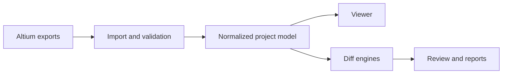

# Altium Diff Studio

> Compatibility note: the exporter and the full workflow have currently been
> validated with Altium Designer 26.7.1. Exports from other Altium versions may
> work when they follow the documented ADS JSON contract, but they should be
> reviewed carefully.

Altium Diff Studio is a local desktop application for viewing, comparing and
reviewing electronic design projects exported from Altium Designer.

The main experience is now a project viewer with simple and advanced modes.
Simple mode keeps the screen focused on the controls needed for quick design
review, while advanced mode exposes layer, rendering and diagnostic controls.
Comparison remains available as a secondary action when a second project version
is loaded.

All project data is processed locally. The application does not upload design
files.

## Current Capabilities

- Viewer-first workspace with source chips for LOGIC, BOM, PCB, DXF, PDF and
  GBR, with the last selected viewer tab restored per project.
- Load screen guidance that maps project, schematic, fabrication and BOM views
  to their accepted file formats.
- Large JSON, DXF, Gerber and ODB++ imports are read in chunks with progress
  updates and cancellation checks.
- Schematic JSON import accepts native-style component and pin field names and
  preserves multi-part owner metadata for later connectivity analysis.
- Flat native schematic record batches can be converted into typed schematic
  components, pins, wires, labels and topology markers when ADS containers are
  not already present.
- Canonical ADS schema versions are preserved during import; explicit
  non-canonical probe versions remain loadable but are reported as warnings.
- Native-style component parameters are accepted as objects, parameter arrays or
  compact parameter strings and feed project search plus inspector metadata.
- Native-style schematic labels, wires, ports, hierarchy markers and bus entries
  are normalized into typed ADS fields before validation.
- Schematic bounds, symbol graphics, text render hints and annotations are also
  normalized so faithful rendering can reuse typed geometry.
- A tested schematic render-geometry helper prepares wires, buses, markers,
  annotations, component graphics and logical node links for the faithful sheet
  canvas.
- The schematic viewer includes a native Sheet representation when normalized
  render geometry is available, while the logical view remains available for
  navigation and semantic comparison.
- ADS document capabilities are centralized by design data, netlist data and
  graphical enrichment roles to prepare a future schema split.
- Named schematic bus entries are included in the project net catalog and merged
  as external logical nets when the same bus-entry name appears in multiple places.
- Bus-entry ranges such as `DATA[0..7]` and `ADDR<3:0>` are expanded into
  searchable external bit nets in the project index.
- Valid parent sheet-entry to child port/off-sheet connector matches are exposed
  as hierarchy links in the schematic net catalog.
- Hidden schematic power pins can be inferred from safe pin names such as VCC or
  GND when native hidden-net metadata is missing, with diagnostics for ambiguous pins.
- Simple mode by default. PCB viewer mode keeps selection, Top/Bottom side
  choice and compact component/track navigation visible. Advanced mode exposes
  full layer browsing, opacity and rendering controls.
- PCB comparison with diff view, A/B view and before/after slider. Simple PCB
  comparison keeps only Component/Track selection, View mode and Top/Bottom
  controls visible.
- PCB component hover/selection highlights outlines; track/net selection
  highlights tracks, arcs, pads, vias and bus-style grouped nets with subdued
  halos.
- Direct PCB side controls: Top/Bottom in simple mode, All/custom layer browsing
  in advanced mode.
- Light, low-visibility vias shown by default so routing context is preserved
  without dominating the PCB view.
- Schematic logical view, Smart PDF fallback and semantic DXF comparison.
  In comparison mode, the logical view is a page/block overview; clicking a
  block opens the matching DXF sheet when DXF files are available.
- Fast previous/next navigation across schematic sheets in viewer and compare modes.
- BOM comparison with changed fields, values A/B, sortable/filterable columns,
  detected version labels and CSV export.
- Viewer BOM lists hide non-mounted and mechanical references so navigation
  stays focused; advanced mode can reveal them with a reason badge, and BOM
  comparison still keeps those references to catch fitted / not-fitted changes.
- Project search and the component inspector merge BOM and schematic component
  parameters, so schematic-only MPN or metadata remains discoverable.
- Dedicated comparison Report tab with review changes, author metadata,
  migration, comments, snapshots and portable JSON import/export.
- HTML/PDF review reports with metadata, diagnostics, review coverage and view
  captures.
- Fabrication file intake for Gerber, drill and ODB++ packages. Gerber files
  get a visual layer preview from common apertures, draws, arcs and flashes.
  Comparison mode intentionally uses a lighter Gerber layer-by-layer workflow:
  each layer reports added/removed/common normalized lines and displays A/B
  geometry overlays. ODB++ packages remain available for viewer-side inspection
  and summaries, but ODB++ comparison is not part of the V1 comparison workflow.

## Supported Inputs

| Format            | Purpose                                                                                                                    | Required |
| ----------------- | -------------------------------------------------------------------------------------------------------------------------- | -------- |
| PCB JSON          | Components, tracks, pads, vias, polygons, layers and outline                                                               | Per view |
| Schematic JSON    | Sheets, components, pins, wires, labels and hierarchy                                                                      | Per view |
| BOM JSON          | Items, values, footprints, designators and parameters                                                                      | Per view |
| ADS manifest JSON | Export package metadata                                                                                                    | No       |
| DXF               | Visual schematic sheet representation                                                                                      | No       |
| Smart PDF         | Altium reference document, viewer fallback only                                                                            | No       |
| Gerber / Drill    | Fabrication layers and drill files, including Altium numeric layers such as `G1..G16`, `GM1..GM16`, `GD1`, `GG1` and `APR` | No       |
| ODB++             | Rich fabrication package with layers, drills, placements and nets                                                          | No       |

When JSON files are loaded, the application automatically searches for nearby
Smart PDF and schematic DXF files. Gerber, drill and ODB++ files can also be
loaded directly with the project. PDF is intentionally excluded from comparison
mode because the application cannot produce a reliable graphical PDF diff.

## Diff Colors

| Status      | Meaning                                       |
| ----------- | --------------------------------------------- |
| Gray        | Common or unchanged object                    |
| Green       | Added in B                                    |
| Orange      | Modified between A and B                      |
| Red         | Removed from B                                |
| Layer color | Active selection or highlighted net/component |
| Purple      | Report/review workspace tab                   |

Layer colors identify the current context. Diff colors are reserved for actual
changes so common planes and unchanged copper do not hide the signal.

## ADS Export Contract

The canonical exporter is `altium-scripts/ExportDesignData_ADS.pas`.

Current schema identifiers:

- global/exporter schema: `ads-json-v71`
- PCB: `ads-json-pcb-v2`
- schematic: `ads-json-sch-v2`
- BOM: `ads-json-bom-v1`

The public contract is documented in `altium-scripts/ADS_SCHEMA.md`, with
extended PCB and schematic details in `altium-scripts/PCB_SCHEMA_V2.md` and
`altium-scripts/SCHEMATIC_SCHEMA_V2.md`.

## Altium OutJob Setup

For a complete ADS project package, keep all generated files in the same output
folder. The JSON files are produced by `ExportDesignData_ADS.pas`; the OutJob
should produce the visual and fabrication files that the app can auto-detect
next to those JSON files.

Recommended output layout:

```text
<Project>_bom.json
<Project>_pcb.json
<Project>_schematic.json
<Project>_ads_manifest.json
<Project>_smart.pdf
<Project>_schematic_dxf/
  <SheetName>.dxf
Gerber/drill files, for example GTL, GBL, GTS, GBS, GTP, GBP, GM1, GD1, G1...
```

Recommended OutJob entries:

| OutJob output                     | Container / format         | Output name or folder             | Used for                   |
| --------------------------------- | -------------------------- | --------------------------------- | -------------------------- |
| Script output / ADS JSON exporter | `ExportDesignData_ADS.pas` | Same folder as the project export | BOM, PCB, schematic JSON   |
| Schematic Prints                  | PDF                        | `<Project>_smart.pdf`             | Smart PDF fallback         |
| AutoCAD DWG/DXF Schematic         | DXF ASCII                  | `<Project>_schematic_dxf` folder  | Altium-like schematic view |
| Gerber Files                      | RS-274X / Gerber           | Standard Altium layer extensions  | Fabrication viewer/diff    |
| NC Drill Files                    | Excellon / drill           | Same Gerber output folder         | Drill/fabrication context  |
| ODB++                             | ODB++ zip or folder        | Same export folder, optional      | Viewer-side inspection     |

OutJob configuration notes:

1. Add `ExportDesignData_ADS.pas` to an Altium Script Project (`.PrjScr`).
2. In the OutJob, add a script output that calls `Generate` or `Run` from
   `ExportDesignData_ADS.pas`. If the OutJob UI asks for parameters, use one of
   `PCB`, `SCH` or `BOM` for a partial export, or leave parameters empty for the
   full JSON export.
3. Add **Schematic Prints** to a PDF output container and set the output filename
   to `<Project>_smart.pdf`.
4. Add **AutoCAD DWG/DXF Schematic** for all schematic sheets. Use ASCII DXF and
   write the files into `<Project>_schematic_dxf`. Naming each DXF after its
   `.SchDoc` gives the best automatic matching.
5. Add **Gerber Files** and **NC Drill Files** for the PCB fabrication package.
   ADS accepts common Altium extensions such as `GTL`, `GBL`, `GTS`, `GBS`,
   `GTP`, `GBP`, `GTO`, `GBO`, `GM1..GM16`, `G1..G16`, `GD1`, `GG1` and `APR`.
6. Keep the OutJob output folder stable between versions A and B. The comparator
   works best when both versions have the same file families and naming pattern.

If only the JSON files are present, the application can still load BOM, PCB and
logical schematic data. DXF, Smart PDF and Gerber/ODB++ files are optional, but
they unlock the visual schematic and fabrication views used by the V1 workflow.

## Architecture



Key folders:

```text
src/lib/components/   Svelte UI, canvases and viewer surfaces
src/lib/diff/         PCB, schematic, BOM, DXF and fabrication diff engines
src/lib/domain/       Normalization, geometry, fabrication and project-domain helpers
src/lib/state/        Workspace import, selection, diagnostics and persistence
src/lib/types/        TypeScript models for exported design data
altium-scripts/       Altium DelphiScript exporter and schema documentation
tests/                Unit, integration and fixture-based regression tests
```

Large PCB data is rendered on Canvas 2D. The application caches PCB diffs,
geometry bounds, layer ordering, spatial indexes and slider frames so zoom,
pan, hover and selection stay responsive on large boards.

## Development

Requirements:

- A recent Node.js version
- npm
- Windows is recommended for Altium Designer integration and Electron packaging

Common commands:

```bash
npm install
npm run dev
npm test
npm run test:performance
npm run check
npm run lint
npm run build
npm run dist:win
```

Developer tools stay closed by default. Set `ADS_OPEN_DEVTOOLS=1` before
starting the app if you want Electron to open them automatically.

## Keyboard Shortcuts

| Shortcut       | Action                             |
| -------------- | ---------------------------------- |
| `Ctrl+O`       | Open version A                     |
| `Ctrl+Shift+O` | Open version B                     |
| `Alt+1`        | PCB view                           |
| `Alt+2`        | Schematic view                     |
| `Alt+3`        | BOM view                           |
| `Ctrl+F`       | Search                             |
| `Esc`          | Close the active dialog or palette |

On macOS, use `Cmd` instead of `Ctrl` for application shortcuts.

## Diagnostics And Limits

Import validation reports missing or incompatible exporter metadata, unusable
geometry, duplicate identifiers, missing PCB outlines or layer lists, empty
schematics and recoverable data issues.

Schematic connectivity diagnostics are intentionally conservative. They are
reported as warnings when the importer can keep the project usable but cannot
prove native connectivity exactly. Common cases include bus graphics without
named bus entries, one physical wire node carrying multiple net names, sheet
entries that reference a missing sheet symbol, parent sheet entries that do not
match child sheet ports, child ports that are not declared by the parent, and
hidden pins whose net cannot be inferred from safe power-rail names. These
warnings mean the logical schematic is still useful for navigation, but the
affected nets should be checked against the ADS JSON, DXF or Smart PDF reference
before review sign-off.

Known limitations:

- Native Altium import is still experimental; ADS JSON remains the canonical
  path.
- Gerber visual rendering currently covers common apertures, straight draws,
  circular interpolation approximated for preview, including full-circle arcs,
  and flashes. V1 comparison is layer-by-layer and line-normalized; a deeper
  geometry-aware Gerber diff is still future work.
- ODB++ packages are accepted and inventoried from readable zip, tar and tar.gz
  entries. Stored/deflated zip plus tar/tgz text entries provide first-pass
  feature, layer-family, component and net extraction, but full ODB++ feature/data
  parsing is still on the roadmap. ODB++ comparison is disabled for V1 because
  full-package comparison is too memory-heavy on large projects.
- Logical comparison block clicks open the matching DXF sheet, but repeated
  sheet instances/channels cannot yet resolve to distinct DXF views.
- The 3D STEP viewer is planned but not implemented yet.
- Review preferences and comments are local to the machine unless exported as a
  session.

## Roadmap

The maintained task list is in `ROADMAP.md`.

Current priorities before starting P3:

1. Validate the V1 viewer and comparison workflows on representative real
   projects.
2. Keep the V1 comparison scope focused on PCB, logical/DXF schematic, BOM and
   layer-by-layer Gerber.
3. Polish import/status diagnostics and report/review ergonomics.
4. Start the STEP/3D mechanical viewer after the P2.5 acceptance checklist is
   good enough on real projects.

## License

This project is distributed under the GNU General Public License v3.0. See
`LICENSE`.

Archived exporter prototypes are kept under `altium-scripts/old ADV export v1`
for reference only. `ExportDesignData_ADS.pas` is the maintained exporter.
