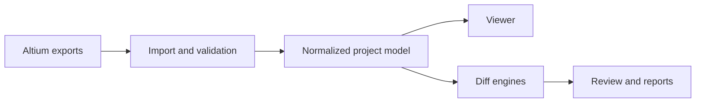

# Altium Diff Studio

> Compatibility note: the exporter and the full workflow have currently been
> validated with Altium Designer 26.7.1. Exports from other Altium versions may
> work when they follow the documented ADS JSON contract, but they should be
> reviewed carefully.

Altium Diff Studio is a local desktop application for viewing, comparing and
reviewing electronic design projects exported from Altium Designer.

The main experience is now a project viewer: a compact BOM on the left and a
viewer on the right for schematic, PCB, fabrication data, 3D and BOM. Selecting
a component in the BOM highlights it in the viewer, and selecting a component in
the viewer updates the BOM. Comparison remains available as a secondary action
when a second project version is loaded.

All project data is processed locally. The application does not upload design
files.

## Current Capabilities

- Viewer-first workspace with a minimal BOM rail and SCH, PCB, FAB, 3D and BOM
  tabs, with the last selected tab restored per project.
- Simple mode by default, with advanced PCB/SCH/BOM diff controls still
  available behind the advanced toggle.
- PCB comparison with layer visibility, opacity controls, diff view, A/B view
  and before/after slider.
- Direct All/Top/Bottom PCB side controls for quick 2D board inspection.
- Light, low-visibility vias shown by default so routing context is preserved
  without dominating the PCB view.
- Schematic logical view, Smart PDF fallback and semantic DXF comparison.
- Fast previous/next navigation across schematic sheets in viewer and compare modes.
- BOM comparison with changed fields, values A/B, filters, comments and CSV
  export.
- Review sessions with author metadata, migration, comments, snapshots and
  portable JSON import/export.
- HTML/PDF review reports with metadata, diagnostics, review coverage and view
  captures.
- Fabrication file intake for Gerber, drill and ODB++ packages. Gerber files
  get a first visual layer preview from common apertures, draws and flashes,
  and can still be compared line by line. ODB++ packages are tracked and
  inspected when zip, tar or tar.gz entries are readable, with layer, step,
  drill, placement and net coverage surfaced in the FAB tab.

## Supported Inputs

| Format            | Purpose                                                           | Required |
| ----------------- | ----------------------------------------------------------------- | -------- |
| PCB JSON          | Components, tracks, pads, vias, polygons, layers and outline      | Per view |
| Schematic JSON    | Sheets, components, pins, wires, labels and hierarchy             | Per view |
| BOM JSON          | Items, values, footprints, designators and parameters             | Per view |
| ADS manifest JSON | Export package metadata                                           | No       |
| DXF               | Visual schematic sheet representation                             | No       |
| Smart PDF         | Altium reference document                                         | No       |
| Gerber / Drill    | Fabrication layers and drill files                                | No       |
| ODB++             | Rich fabrication package with layers, drills, placements and nets | No       |

When JSON files are loaded, the application automatically searches for nearby
Smart PDF and schematic DXF files. Gerber, drill and ODB++ files can also be
loaded directly with the project.

## Diff Colors

| Status      | Meaning                                       |
| ----------- | --------------------------------------------- |
| Gray        | Common or unchanged object                    |
| Green       | Added in B                                    |
| Orange      | Modified between A and B                      |
| Red         | Removed from B                                |
| Layer color | Active selection or highlighted net/component |

Layer colors identify the current context. Diff colors are reserved for actual
changes so common planes and unchanged copper do not hide the signal.

## ADS Export Contract

The canonical exporter is `altium-scripts/ExportDesignData_ADS.pas`.

Current schema identifiers:

- global/exporter schema: `ads-json-v71`
- PCB: `ads-json-pcb-v2`
- schematic: `ads-json-sch-v2`
- BOM: `ads-json-bom-v1`

The public contract is documented in `altium-scripts/ADS_SCHEMA.md`, with
extended PCB and schematic details in `altium-scripts/PCB_SCHEMA_V2.md` and
`altium-scripts/SCHEMATIC_SCHEMA_V2.md`.

## Architecture



Key folders:

```text
src/lib/components/   Svelte UI, canvases and viewer surfaces
src/lib/diff/         PCB, schematic, BOM, DXF and fabrication diff engines
src/lib/domain/       Normalization, geometry, fabrication and project-domain helpers
src/lib/state/        Workspace import, selection, diagnostics and persistence
src/lib/types/        TypeScript models for exported design data
altium-scripts/       Altium DelphiScript exporter and schema documentation
tests/                Unit, integration and fixture-based regression tests
```

Large PCB data is rendered on Canvas 2D. The application caches PCB diffs,
geometry bounds, layer ordering, spatial indexes and slider frames so zoom,
pan, hover and selection stay responsive on large boards.

## Development

Requirements:

- A recent Node.js version
- npm
- Windows is recommended for Altium Designer integration and Electron packaging

Common commands:

```bash
npm install
npm run dev
npm test
npm run test:performance
npm run check
npm run lint
npm run build
npm run dist:win
```

Developer tools stay closed by default. Set `ADS_OPEN_DEVTOOLS=1` before
starting the app if you want Electron to open them automatically.

## Keyboard Shortcuts

| Shortcut       | Action                             |
| -------------- | ---------------------------------- |
| `Ctrl+O`       | Open version A                     |
| `Ctrl+Shift+O` | Open version B                     |
| `Alt+1`        | PCB view                           |
| `Alt+2`        | Schematic view                     |
| `Alt+3`        | BOM view                           |
| `Ctrl+F`       | Search                             |
| `Esc`          | Close the active dialog or palette |

On macOS, use `Cmd` instead of `Ctrl` for application shortcuts.

## Diagnostics And Limits

Import validation reports missing or incompatible exporter metadata, unusable
geometry, duplicate identifiers, missing PCB outlines or layer lists, empty
schematics and recoverable data issues.

Known limitations:

- Native Altium import is still experimental; ADS JSON remains the canonical
  path.
- Gerber visual rendering currently covers common apertures, straight draws and
  flashes; arc handling and geometry-aware comparison are still on the roadmap.
- ODB++ packages are accepted and inventoried from readable zip, tar and tar.gz
  entries, but full feature/data parsing is still on the roadmap.
- The 3D STEP viewer is planned but not implemented yet.
- Review preferences and comments are local to the machine unless exported as a
  session.

## Roadmap

The maintained task list is in `ROADMAP.md`.

Current priorities:

1. Finish the viewer-first workspace and keep advanced tools behind an explicit
   toggle.
2. Build the fabrication viewer around Gerber and ODB++, then decide whether
   ODB++ can replace part of the Gerber workflow.
3. Improve native Altium data coverage for schematic fidelity and project
   navigation.
4. Add the 3D STEP viewer and link it to BOM/PCB selection.

## License

This project is distributed under the GNU General Public License v3.0. See
`LICENSE`.

Archived exporter prototypes are kept under `altium-scripts/old ADV export v1`
for reference only. `ExportDesignData_ADS.pas` is the maintained exporter.
