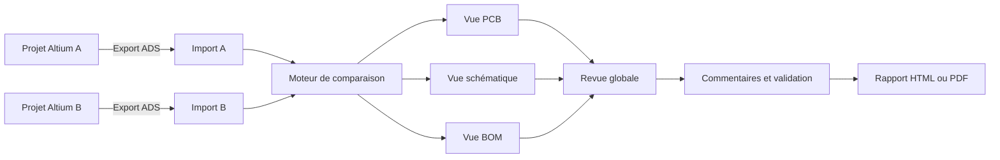
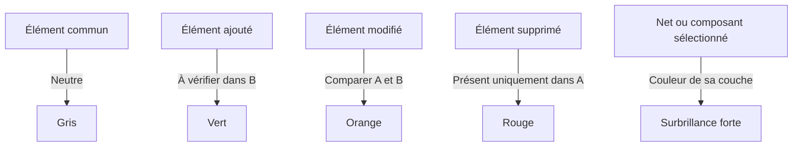
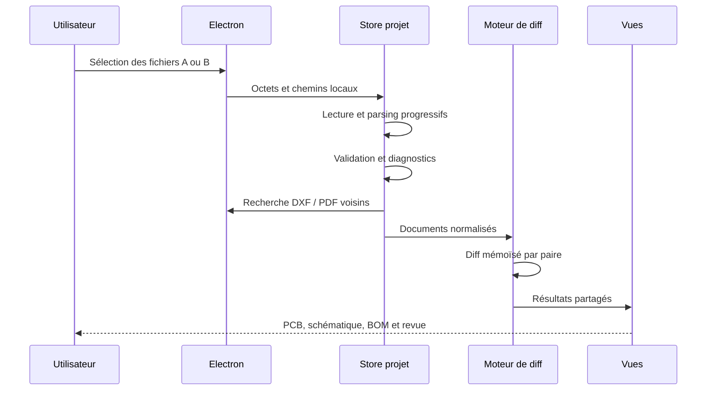
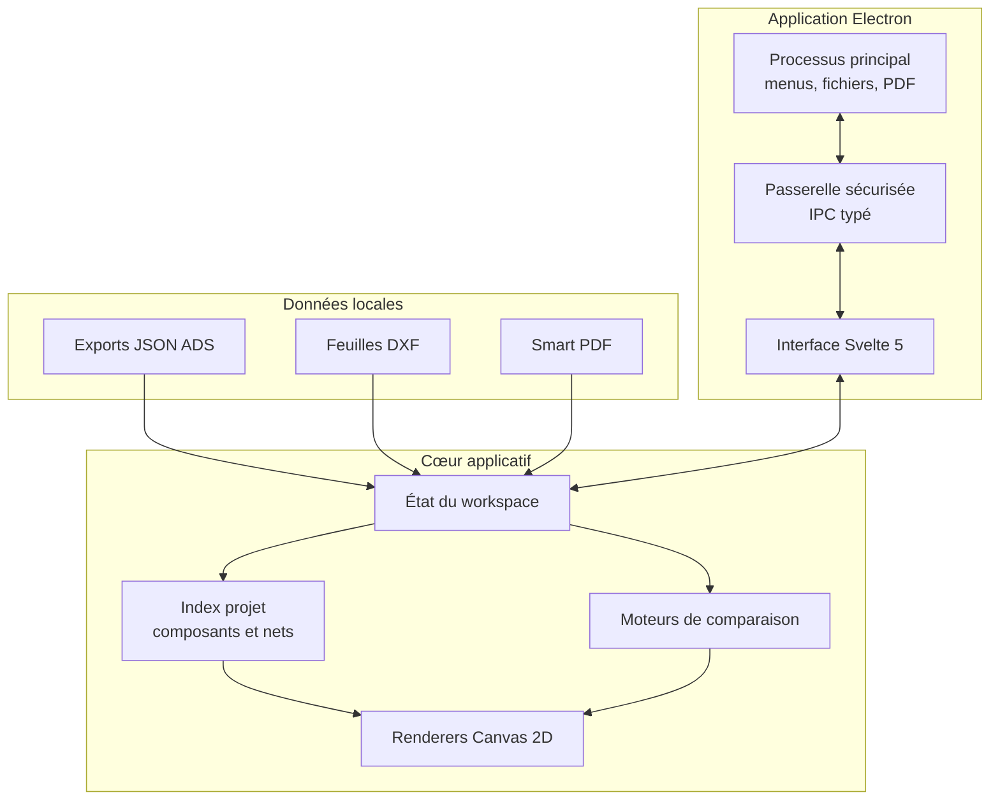

# Altium Diff Studio

> Application de bureau locale pour visualiser, comparer et réviser des projets
> Altium Designer.

Altium Diff Studio rapproche les données **PCB**, **schématiques** et **BOM** dans
une interface unique. L’objectif est de rendre une revue de conception lisible :
voir ce qui a changé, retrouver le composant ou le net concerné, documenter la
décision puis exporter un rapport.


[](https://github.com/pixellove4ever/Altium-Diff-Studio/actions/workflows/ci.yml)

## Vue d’ensemble



Deux modes sont disponibles :

- **Visualisation** : inspection d’un seul export ;
- **Comparaison** : revue synchronisée de deux versions A et B.

Toutes les données sont traitées localement. L’application n’envoie aucun projet
vers un service distant.

## Fonctions principales

### PCB

- rendu multicouche avec sélection, opacité et activation globale des couches ;
- comparaison en vue **Diff**, **A | B** ou avec un **slider avant/après** ;
- éléments communs neutralisés en gris et différences mises en couleur ;
- plans communs grisés pour éviter qu’ils dominent la lecture ;
- sélection d’un net sur toutes ses couches, même masquées ;
- recherche et centrage automatique sur la couche d’un composant ;
- miroir horizontal du PCB avec bouton et raccourci `M` ;
- affichage optionnel des composants, textes, vias, plans, designators et repères pin 1 ;
- options visuelles désactivées par défaut, sauf les plans de cuivre ;
- info-bulles et sélection directe des pads, pistes, nets et composants.
- profileur optionnel des frames Canvas pour diagnostiquer un grand PCB réel.

### Schématique

- vue logique compacte avec composants différenciés par famille ;
- alimentation et masse intégrées aux blocs ;
- nets, test points et relations électriques affichés dans la vue logique ;
- comparaison logique **Avant / Changements / Après** ;
- navigation par composant ou par net ;
- comparaison DXF sémantique avec primitives communes grisées et différences colorées ;
- vues DXF synchronisées, seules, côte à côte ou avec slider ;
- consultation du JSON source et du Smart PDF lorsqu’ils sont disponibles.

### BOM et revue

- comparaison des valeurs, empreintes, paramètres et designators ;
- recherche globale par composant, valeur, empreinte ou net ;
- navigation liée entre BOM, schématique et PCB ;
- liste consolidée des changements ;
- synthèse chiffrée par statut et par domaine PCB/SCH/BOM ;
- filtres combinables par statut de différence et domaine ;
- marquage des éléments relus et ajout de commentaires ;
- instantanés PCB ou schématiques compressés associés aux commentaires ;
- restauration locale de l’avancement pour une même paire de projets ;
- export et import d’une session de revue JSON portable, instantanés inclus ;
- export d’un rapport HTML ou PDF complet ou filtré, avec page de garde, métadonnées
  des fichiers, diagnostics, couverture de revue et captures des vues.
- navigation directe de la BOM vers le composant dans le schéma, avec centrage, zoom et
  halo de sélection dans les vues logique et DXF.
- contours d’empreintes PCB visibles par défaut afin de conserver la forme mécanique des
  connecteurs et autres composants volumineux.
- sessions de revue v3 avec auteur, date de modification, fusion ou remplacement à
  l’import, migration des anciennes versions et détail des entrées ignorées.
- préférences PCB mémorisées séparément pour chaque paire de projets : couches,
  opacités, mode de comparaison et options de rendu.
- contrat ADS versionné pour PCB, schématique et BOM, accompagné d’exemples
  minimaux validés automatiquement.
- validation ADS avant comparaison avec erreurs bloquantes pour la géométrie
  inutilisable et avertissements détaillés pour les doublons récupérables.
- vue logique renforcée pour les composants multi-parties, pins cachées, liaisons
  hiérarchiques et associations testpoint/net ambiguës.

## Lecture des différences



La couleur d’une couche sert à identifier une sélection active. Les couleurs de
diff sont réservées aux changements afin que les plans et objets communs ne
masquent pas l’information importante.

## Fichiers pris en charge

L’exporteur canonique
[`altium-scripts/ExportDesignData_ADS.pas`](altium-scripts/ExportDesignData_ADS.pas)
produit les données structurées utilisées par l’application.

| Format            | Rôle                                                      | Obligatoire  |
| ----------------- | --------------------------------------------------------- | ------------ |
| PCB JSON          | composants, pistes, pads, vias, plans, couches et contour | selon la vue |
| Schematic JSON    | composants, pins, nets, liaisons et hiérarchie            | selon la vue |
| BOM JSON          | articles, valeurs, empreintes et paramètres               | selon la vue |
| ADS manifest JSON | métadonnées du paquet exporté                             | non          |
| DXF               | représentation fidèle de chaque feuille schématique       | non          |
| Smart PDF         | document Altium de référence                              | non          |

L’application recherche automatiquement les DXF et le Smart PDF placés à
proximité des JSON. Les métadonnées de l’exporteur sont vérifiées afin de signaler
les paquets incomplets ou issus de schémas incompatibles.

Version actuelle de l’exporteur :

- script : `ADS-1.12.0` ;
- schéma global : `ads-json-v71` ;
- PCB : `ads-json-pcb-v2` ;
- schématique : `ads-json-sch-v2`.

## Pipeline d’import



Le chargement affiche son étape courante et laisse l’interface se rafraîchir
entre les opérations lourdes. Un import plus ancien ne peut pas écraser un choix
plus récent. Un import en cours peut être annulé ; le Worker associé est alors
terminé immédiatement. Les lectures natives sont sérialisées afin de limiter le
pic mémoire lors de la sélection de plusieurs gros fichiers.

## Architecture



```text
altium-scripts/       Exporteur DelphiScript et contrat ADS
electron/             Processus principal et passerelle locale
src/lib/components/   Vues, Canvas et composants d’interface
src/lib/diff/         Comparaison BOM, PCB et schématique
src/lib/domain/       Index projet et graphe logique
src/lib/state/        Import, diagnostics et état du workspace
src/lib/types/        Modèle TypeScript des exports Altium
tests/                Tests du diff et du graphe logique
```

## Performances

Les gros PCB sont rendus sur Canvas 2D. Plusieurs optimisations évitent de
recalculer la carte entière lors d’une interaction :

- diff PCB calculé une fois puis partagé entre la revue et les vues ;
- appariement linéaire des primitives communes et gestion des doublons ;
- normalisation des pistes et polygones pour ignorer les variations d’export ;
- cache des limites géométriques de chaque document ;
- tri des primitives par couche uniquement lorsque les couches changent ;
- rendu A/B du slider conservé dans des Canvas hors écran ;
- survol limité à une résolution par frame, sans copie des collections ;
- index spatial des pads, pistes et composants pour les cartes denses ;
- parsing JSON exécuté dans un Worker pour préserver la réactivité de l’interface.

## Installation et développement

Prérequis :

- Node.js récent ;
- npm ;
- Windows recommandé pour l’intégration avec Altium Designer.

```bash
npm install
npm run dev
```

Les outils développeur restent fermés par défaut. Pour les ouvrir automatiquement
pendant une session de diagnostic :

```powershell
$env:ADS_OPEN_DEVTOOLS = '1'
npm run dev
```

Commandes utiles :

```bash
npm test       # tests unitaires
npm run test:performance # benchmark PCB synthétique
npm run check  # vérification TypeScript et Svelte
npm run lint   # Prettier et ESLint
npm run build  # build Electron de production
npm run format # formatage du dépôt
```

### Installateur Windows

`npm run dist:win` produit dans `release/` un installateur NSIS x64 clairement
nommé `Altium Diff Studio-Setup-<version>-unsigned.exe`. Il n’est pas signé tant
qu’aucun certificat de signature n’est configuré.

`npm run test:installer` effectue sous Windows une installation silencieuse, une
réinstallation simulant une mise à jour, puis une désinstallation. La CI exécute
ce contrôle et conserve l’installateur pour chaque tag `v*`.

## Raccourcis clavier

| Raccourci      | Action                                 |
| -------------- | -------------------------------------- |
| `Ctrl+N`       | Nouveau workspace                      |
| `Ctrl+O`       | Ouvrir la version A                    |
| `Ctrl+Shift+O` | Ouvrir la version B                    |
| `Ctrl+K`       | Palette de commandes et recherche      |
| `Ctrl+.`       | Afficher ou masquer les outils         |
| `Ctrl+Shift+F` | Afficher ou masquer l’inspecteur       |
| `Alt+1`        | Vue PCB                                |
| `Alt+2`        | Vue schématique                        |
| `Alt+3`        | Vue BOM                                |
| `M`            | Basculer le miroir horizontal du PCB   |
| `F1`           | Aide et raccourcis                     |
| `Échap`        | Fermer la fenêtre ou la palette active |

Sous macOS, utiliser `Cmd` à la place de `Ctrl` pour les raccourcis applicatifs.

## Qualité et diagnostics

L’import produit des diagnostics par fichier :

- métadonnées d’exporteur absentes ou incompatibles ;
- document vide ou tableau obligatoire manquant ;
- contour PCB ou liste de couches absente ;
- schématique sans feuille, composant ou labels de nets ;
- JSON invalide ou format non reconnu.

La suite de tests couvre notamment les changements BOM, les composants
schématiques, la géométrie des routes, les doublons, les arrondis de coordonnées,
les polygones équivalents, les plans communs, les rails d’alimentation et
l’association des test points. Une paire A/B versionnée dans `tests/fixtures`
vérifie également la cohérence transversale des trois vues.

Le protocole, les seuils et la baseline du benchmark PCB sont décrits dans
[PERFORMANCE.md](PERFORMANCE.md).

## Limites actuelles et suite

- le transfert en mémoire d’un très gros JSON reste proportionnel à sa taille ;
- la fidélité de la vue logique dépend des relations exportées par Altium ;
- le DXF sert à la comparaison visuelle, pas encore à une classification
  sémantique de chaque primitive ;
- les préférences et commentaires sont locaux à la machine.

La liste détaillée et maintenue se trouve dans la
[roadmap du projet](ROADMAP.md).

Priorités actuelles :

1. constituer un jeu de régression et des tests de performance reproductibles ;
2. profiler le rendu et l’import de très grands PCB ;
3. ajouter des instantanés visuels aux commentaires de revue ;
4. rendre la comparaison DXF sémantique ;
5. stabiliser le contrat ADS et préparer l’intégration continue.

## Licence

Ce projet est distribué sous licence
[GNU General Public License v3.0](LICENSE).

Les anciens prototypes d’exporteur sont conservés dans
`altium-scripts/old ADV export v1`. Le fichier
`ExportDesignData_ADS.pas` reste la référence à utiliser.
